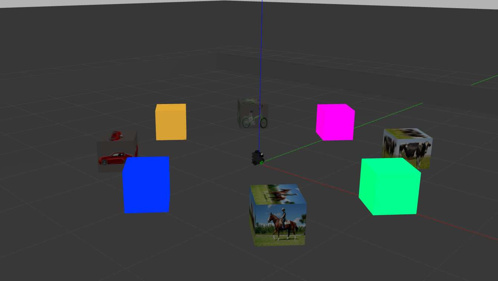
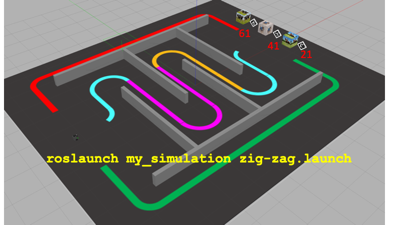

# Robótica Computacional 2023.1

## Revisão 

## Questões de ROS

**Atenção: ** 

Para fazer estas questões você precisa ter o `my_simulation` e o `mybot_description` atualizado.

    cd ~/catkin_ws/src
    cd my_simulation
    git stash
    git pull

Ou então se ainda não tiver:

    cd ~/catkin_ws/src
    git clone https://github.com/arnaldojr/my_simulation.git

Para o mybot_description:

    cd ~/catkin_ws/src
    cd mybot_description
    git stash
    git pull

Ou então se ainda não tiver:

    cd ~/catkin_ws/src
    git clone https://github.com/arnaldojr/mybot_description

Em seguida faça o [catkin_make](./instrucoes_setup.md). 

## Questão 1

Você deverá fazer o robô gerar aleatoriamente um números entre 1 e 3 ($n1$). Então ele deverá ir até o cubo com a figura indicada por $n1$, parar a $30 cm$ do mesmo e depois avançar até o cubo da cor indicada por $n1$, parando a $30 cm$ do mesmo e levantando a garra.

Para iniciar o cenário do Gazebo, *atualize* o repositório `my_simulation` e execute:

    roslaunch my_simulation encaixotado.launch
    roslaunch mybot_description mybot_control2.launch 

#### O que é para fazer

Faça o robô visitar primeiro um cubo com um afigura, e depois um cubo de cor sólida com base em $n1$ e $n2$ respectivamente, ambos inteiros sorteados aleatoriamente entre 1 e 4. A figura e a cor correspondem aos números da tabela abaixo:

|Número | Figura | Cor 
|---|---|---|
| **1** | Vaca | Amarelo |
| **2** | Cavalo | Verde |
| **3** | Carro  | Azul  |
| **4** | Bicicleta  | Magenta |

Para responder à questão você deverá trabalhar em `sim3_222/scripts/Q1.py`.

|Resultado| Conceito| 
|---|---|
| Não executa | 0 |
| Identifica os objetos da imagem **ou** segmenta a cor desejada | 1.0 |
| Identifica os objetos da imagem **e** segmenta a cor desejada | 2.0 |
| Consegue ir até o primeiro cubo  | 3.2 |
| O robô consegue ir até os dois cubos, mas não para nem levanta a garra| 4.2 |
| Faz tudo o que se pede | 5.0|

Casos intermediários ou omissos da rubrica serão decididos pelo professor.

## Questão 2

Seu robô está no cenário visível abaixo:

</img>

Que pode ser disparado com o comando: 

    roslaunch my_simulation zig-zag.launch

Sabe-se que se um robô seguir uma parede em um labirinto virando sempre para o mesmo lado  quando encontra um obstáculo (direita ou esquerda) eventualmente vai acabar saindo do labirinto. 

Seu robô precisa percorrer os corredores e encontrar um animal de interesse lá no final. Depois deve retornar. 

#### O que é para fazer

**Inicialmente** você deve sortear um número inteiro entre 0 ou 1, correspondendo respectivamente a *cachorro* e *cavalo*.

**Passo 1** o robô vai precisar seguir os corredores definidos pela parede e pela pista ciano-magenta-laranja-ciano. Para fazer isso pode usar qualquer método (seguir as pistas, ou virar sempre para a esquerda quando encontrar obstáculo). O importante é sair do outro lado

**Passo 2** o robô vai precisar encontrar o seu animal sorteado, parar na frente dele a 50cm 

**Passo 3** O robô deve então escolher seguir de volta a pista vermelha ou verde para retorna à posição inicial 

#### Detalhes de como rodar

O código para este exercício está em: `sim3_222/scripts/Q2.py`

|Resultado| Conceito| 
|---|---|
| Não executa | 0 |
| Entra no labirinto e consegue realizar pelo menos 2 curvas corretas | 0.75 | 
| Chega ao final do labirinto | 2.0 | 
| Localiza o animal e vai em direção a ele | 3.0 | 
| Dá a mensagem e para em frente ao animal pelo tempo certo | 4.0 | 
| Segue a pista vermelha ou verde pelas bordas e volta ao início | 5.0 |

Casos intermediários ou omissos da rubrica serão decididos pelo professor.

**Boa sorte!!**
